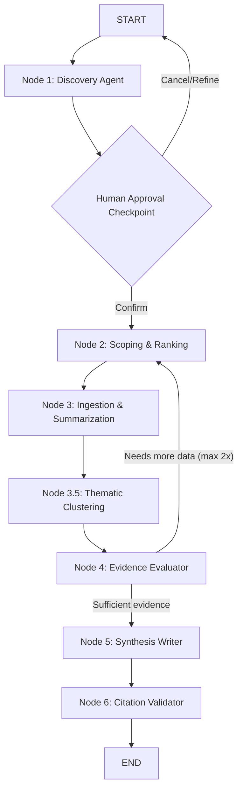

# `/paper` Workflow Architecture and Implementation

This document details the architecture, state management, and node-based execution of the `/paper` command using LangGraph on the MCP client side. This command instructs the AI to generate a formally structured research paper on a user-defined topic, constrained by authentic CDLI artifact data. 

---

## 1. Architectural Overview

Instead of relying on a fragile, prompt-based pipeline where the LLM is expected to sequentially follow complex instructions within a single context window, the `/paper` workflow is orchestrated programmatically using a **LangGraph state machine** on the client side (e.g., the middleware serving the chat widget).

**The Separation of Concerns:**
1.  **CDLI MCP Server:** Remains exactly as designed. It exposes stateless tools (`advanced_search`, `get_artifact`, `get_translation`, etc.).
2.  **LangGraph Orchestrator (Client-side):** Manages the multi-turn workflow, controls which tools the LLM can use at each step, isolates context windows to prevent hallucinations, and streams progress updates back to the UI.

---

## 2. Graph State Definition

LangGraph passes a `PaperState` object between nodes. This state acts as the memory for the entire workflow, ensuring that nodes only receive the specific data they need.

```python
class ArtifactBrief(TypedDict):
    id: str           # P-number e.g. "P010451"
    title: str        # Designation or Museum No
    period: str       # e.g. "Ur III"
    provenience: str  # e.g. "Girsu"

class Theme(TypedDict):
    name: str
    supporting_artifacts: list[str]
    summary: str

class PaperState(TypedDict):
    topic: str                          # User's query
    found_artifacts: list[ArtifactBrief] # Raw Discovery results
    shortlisted_artifacts: list[ArtifactBrief] # Top 10 ranked
    artifact_summaries: list[str]       # Concise interpretive summaries
    themes: list[Theme]                 # Clustered themes
    draft: str                          # Final Markdown synthesis
    errors: list[str]                   # Collected issues
```


---

## 3. The Agentic Nodes

The workflow is broken down into four distinct phases, configured as LangGraph nodes. Each node equips the LLM with a specific system prompt and an isolated subset of tools.

### Node 1: Discovery Agent
*   **Input:** `topic`
*   **Tools Enabled:** `advanced_search`
*   **Responsibility:** Formulates 1-3 distinct search queries based on the topic to cast a wide net across the CDLI corpus. It extracts the IDs and basic metadata of the results.
*   **Output:** Pushes results to the `found_artifacts` state array.

### Node 2: Scoping & Ranking Agent
*   **Input:** `topic`, `found_artifacts`
*   **Tools Enabled:** None.
*   **Responsibility:** Evaluates all discovered artifacts purely based on their metadata (genre, period compatibility with the topic, and presence of translations). It ranks them and enforces a strict cap of **10 artifacts**.
*   **Output:** Pushes the top 10 to `shortlisted_artifacts`.

### Node 3: Ingestion & Summarization (Map-Reduce)
*   **Input:** `shortlisted_artifacts`, `topic`
*   **Tools Enabled:** `get_artifact`, `get_translation`
*   **Responsibility:** LangGraph iterates over the 10 artifacts sequentially or in parallel. For each artifact:
    1. Fetches full metadata and transliteration.
    2. Uses the LLM to write a concise, 3-sentence summary relevant *only* to the user's `topic`.
    3. Discards the raw ATF text immediately to save token context.
*   **Output:** Appends the generated summaries to `artifact_summaries`. Catches tool timeouts and appends errors to the `errors` state without terminating the graph.

### Node 3.5: Thematic Clustering Agent
*   **Input:** `artifact_summaries`
*   **Tools Enabled:** None.
*   **Responsibility:** Reads through all 10 artifact summaries to identify recurring patterns, themes, or historical arguments. It groups the summaries into distinct thematic clusters. Instead of a linear dump of facts, this provides an organizational backbone for a compelling research paper.
*   **Output:** Generates a structured array of `themes` (each containing a theme name, a synthesized summary of that theme, and the IDs of supporting artifacts).

### Node 4: Evidence Evaluator
*   **Input:** `themes`, `evaluation_attempts`
*   **Tools Enabled:** None.
*   **Responsibility:** Acts as a critical academic editor. It audits the thematic clusters for depth and diversity. If the themes are too vague or cover fewer than 4 unique artifacts, it signals that more data is needed. This triggers an automatic loop back to the Scoping node to find alternative artifacts. The loop is capped at **2 retries** to prevent infinite cycles.
*   **Output:** Sets `needs_more_research: bool`. If `True`, the graph routes back to **Node 2 (Scoping)**; if `False`, it advances to synthesis.

### Node 5: Synthesis Writer
*   **Input:** `topic`, `themes`
*   **Tools Enabled:** None.
*   **Responsibility:** Writes the final research paper based *exclusively* on the clustered `themes`. The LLM physically cannot access raw transliterations here, preventing context overload and hallucination. **Crucial Rule:** The system prompt for this node strictly dictates that *every single paragraph MUST include an inline citation to a CDLI ID*. Any claim generated without a direct citation is grounds for immediate failure.
*   **Output:** Generates a complete Markdown document and updates the `draft` state.

### Node 6: Citation Validator
*   **Input:** `draft`, `shortlisted_artifacts`
*   **Tools Enabled:** None.
*   **Responsibility:** Performs a final automated integrity check. It parses the entire draft for artifact ID citations (e.g., `[CDLI ID: P254876]`) and cross-references each against the known corpus. Any ID that was not in the original shortlisted set is flagged as a potential hallucination and appended as a clearly-labelled warning at the end of the paper.
*   **Output:** Returns the final `draft` (with warnings if needed) and a `citation_issues` list.

## 4. Control Flow and Human-in-the-Loop

The graph dictates the exact execution edges, completely eliminating the risk of the LLM skipping directly to the writing phase.



**Human-in-the-Loop (`interrupt_before`):**
LangGraph is configured to pause execution right after the Discovery Node. 
The client UI will intercept this state and display: *"Found 45 artifacts matching your topic. Proceed with analyzing the top 10?"* 
The graph resumes only when the user confirms.

## 5. UI Streaming & User Experience

Because LangGraph emits updates on every node transition, the chat widget can provide a deterministic and visually appealing progress indicator instead of a generic loading spinner:

1. **Discovery:** *Searching CDLI for "Agriculture in Sumer"...* (Displays count of found items).
2. **Interrupt:** *Waiting for user confirmation.*
3. **Scoping:** *Ranking artifacts to find the most relevant corpus...*
4. **Ingestion:** *Reading and summarizing artifacts...* (Parallel processing).
5. **Clustering:** *Identifying recurring historical themes...*
6. **Evaluation:** *Evaluating evidence quality... (looping back if needed).*
7. **Synthesis:** *Drafting the final research paper...*
8. **Validation:** *Validating citations against corpus...*
9. **Completion:** Saves the final paper as a `.md` file in the `output/` directory. Any hallucinated citations are flagged with a warning block.